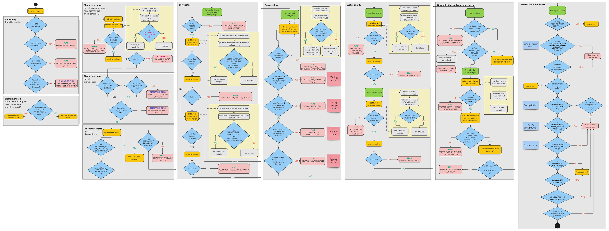

# SSQN - SARS-CoV-2 sewage Quality control and Normalization 
SSQN - (**S**ARS-CoV-2 **S**ewage **Q**uality control and **N**ormalization) is a tool for quality control and normalization of SARS-CoV-2 biomarkers obtained from sewage water.

## Installation from Github
SSQN is completely written in Python 3. We recommend using python 3.8.

To install SSQN using pip
```
pip install git+https://github.com/agblum/sewageQualityControl.git
```

## Usage 

```
ssqn.py --help
```

## Citation 
SSQN can be used and adapted for non-commercial or commercial usage following the CC-BY license. Credit should be given to the authors by including the following citation

```
From wastewater to GIS-based reporting: the ANNA-WES data model for reliable biomarker tracking in wastewater and environmental surveillance. Kau & Uchaikina et al., 2025

```

## Flowchart


